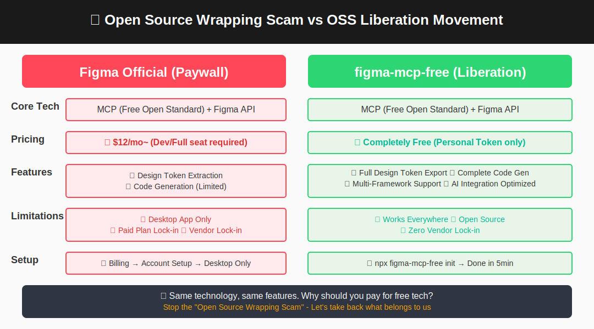
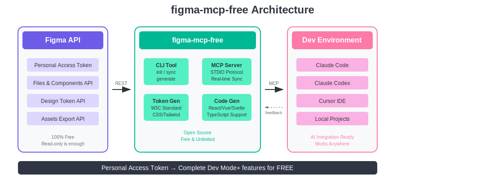

# figma-mcp-free


[](LICENSE)
[](CONTRIBUTING.md)

Free, read-only MCP workflow for Figma using the REST API.

`figma-mcp-free` lets Claude, Cursor, Windsurf, Cline, and local scripts inspect Figma files, list components, export design tokens, and generate starter UI code without depending on a paid Dev Mode MCP seat. It is a community workflow around Figma Personal Access Tokens and the public REST API.

This does not replace Figma Dev Mode or any official write-capable workflow. The Figma REST API is read-only, so this project cannot create, edit, move, or publish design objects back into Figma.

## What It Does

- Runs as an MCP STDIO server for AI coding tools.
- Provides a CLI for component search, code generation, and token export.
- Reads Figma `/file` and `/design` links through a Personal Access Token.
- Converts Figma node JSON into React, Vue, Svelte, or HTML starter code.
- Exports colors, spacing, sizes, typography, and shadows as W3C Design Tokens.
- Includes an offline demo path that works without a Figma token.

## Try It Without A Token

Use the sample node and token files to verify the generator before connecting a real Figma file.

```bash
git clone https://github.com/superdoccimo/figma-mcp-free.git
cd figma-mcp-free
pnpm install
pnpm -r build
pnpm --filter figma-mcp-free dev -- generate-from-json ./examples/sample-node.json --framework react --use-tokens ./examples/sample-tokens.json
```

That command does not call the Figma API. It is the fastest first-run check for contributors, reviewers, and CI-like environments.

## Live Figma Quickstart

1. In Figma, select the target frame or component and copy a link to the selection.
2. Use a `/design` or `/file` URL. `/slides` links are not supported by the Figma REST API.
3. Convert URL node IDs from `node-id=1-2` to `1:2` when passing them to the API or CLI.
4. Store your token locally:

```bash
pnpm --filter figma-mcp-free dev -- init
```

5. Run the CLI:

```bash
pnpm --filter figma-mcp-free dev -- components <FILE_ID> --query Button --limit 5
pnpm --filter figma-mcp-free dev -- export-tokens <FILE_ID> > tokens.json
pnpm --filter figma-mcp-free dev -- generate <FILE_ID> <NODE_ID> --framework react --use-tokens ./tokens.json > out.jsx
```

Quick API check:

```bash
curl -H "X-Figma-Token: $FIGMA_TOKEN" \
  "https://api.figma.com/v1/files/<FILE_ID>/nodes?ids=<NODE_ID>"
```

If JSON is returned, the token, file ID, and node ID are aligned.

## Supported Links And Limits

| Item | Status | Notes |
| --- | --- | --- |
| `/file/<FILE_ID>` | Supported | Use with a selected `node-id` when generating code from one node. |
| `/design/<FILE_ID>` | Supported | Same REST file/node access as `/file`. |
| `/slides/...` | Not supported | Figma's REST API does not expose slide node information for this workflow. |
| `node-id=1-2` | Needs conversion | Figma URLs often use hyphens; API and CLI calls require `1:2`. |
| Write operations | Not supported | REST access is read-only. Use the Figma Plugin API or editor workflows for writes. |
| Images API URLs | Temporary | Good for development checks, but they expire and should not be committed as README or production assets. |

## MCP Server

Build the packages, then launch the STDIO server:

```bash
pnpm -r build
node packages/mcp-server/dist/index.js
```

The server reads `FIGMA_TOKEN` from the environment first. If the environment variable is not present, it falls back to the token stored by `figma-mcp-free init`.

Exposed MCP tools:

- `get_file`
- `get_components`
- `list_frames`
- `generate_code`
- `export_tokens`

Example client configs live in [`examples/codex-config/mcp.json`](examples/codex-config/mcp.json) and [`examples/cursor-config/mcp.json`](examples/cursor-config/mcp.json).

## Packages

| Package | Purpose | Highlights |
| --- | --- | --- |
| `@figma-mcp-free/figma-client` | Figma REST wrapper | Auth headers, file/node/component helpers. |
| `@figma-mcp-free/design-tokens` | Token exporter | W3C Design Tokens for color, size, spacing, typography, and shadow values. |
| `@figma-mcp-free/code-generator` | UI code generator | React, Vue, Svelte, and HTML output from node JSON. |
| `@figma-mcp-free/server` | MCP STDIO server | Tools for MCP-compatible clients. |
| `figma-mcp-free` | CLI | `init`, `components`, `export-tokens`, `generate`, and `generate-from-json`. |

## Visual Overview





## Security

- Keep `FIGMA_TOKEN` in your environment, `.env`, or the local config created by `figma-mcp-free init`.
- Do not commit real tokens, private Figma file IDs, or raw API responses containing sensitive project names.
- In CI, inject the token as a secret environment variable.
- If a token leaks, revoke it in Figma settings and create a new one.
- Prefer masked logs. `figma-mcp-free config get token` prints token status without revealing the full value.

See [SECURITY.md](SECURITY.md) for sensitive report handling.

## Assets And Images

Figma view URLs are not direct image assets. For generated websites and public docs:

- Use files exported from Figma into your app or repository assets.
- Use your own CDN or server for stable production image URLs.
- Treat `images.figma.com` and Images API results as temporary development URLs.
- Keep README diagrams in [`docs/assets/`](docs/assets/) and link them with relative paths.

More details are in [docs/troubleshooting.md](docs/troubleshooting.md).

## Documentation

- [Quickstart](docs/quickstart.md) - install, offline demo, live Figma usage, and MCP setup.
- [Troubleshooting](docs/troubleshooting.md) - token scopes, `/slides`, node IDs, temporary images, and MCP client issues.
- [Why this exists](docs/why-this-exists.md) - project positioning and open workflow context.
- [Demo runbook](docs/demo/runbook.md) - repeatable demo commands.
- [Japanese README](jp/README.md) - detailed Japanese setup and usage guide.
- [Requirements notes](figma_mcp_requirements.md) - longer planning and roadmap context.

## Resources

- English setup guide: [betelgeuse.work/figma-mcp](https://betelgeuse.work/figma-mcp/)
- Spanish setup guide: [ehrigite.com/figma-mcp](https://ehrigite.com/figma-mcp/)
- Japanese setup guide: [minokamo.tokyo](https://minokamo.tokyo/2025/09/18/9360/)
- English video: [figma-mcp-free Setup Tutorial](https://youtu.be/5c2QNSXRwyk)
- Japanese video: [figma-mcp-free setup tutorial](https://youtu.be/f2YqnKAy80Y)

## Contributing

Issues and PRs are welcome. Please keep changes focused, avoid committing secrets, and run:

```bash
pnpm install
pnpm -r build
```

See [CONTRIBUTING.md](CONTRIBUTING.md) and the GitHub issue templates before opening larger changes.
