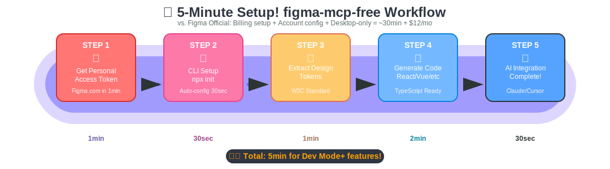

# figma-mcp-free: 無料でFigma Dev Modeを取り戻す

企業がオープンな技術を囲い込む流れに対して、「読み取り専用でも価値を最大化できる」ことを証明するためのGitHub向けハイライトです。この記事では、figma-mcp-freeがどのようにFigma Dev Modeの有料化に対抗し、無料ユーザーでも実用的なワークフローを実現できるかを整理しています。

## 1. 囲い込みの現状を押さえる

FigmaはMCP（Model Context Protocol）対応サーバーをDev Mode有料プランに限定し、Personal Access Token(`X-Figma-Token`)では読み取り専用にとどめています。これは「無料のREST APIに人工的な制限を加えて課金導線を作る」典型例です。

- ✅ 無料トークンで読める: ファイル内容、メタデータ、コンポーネント、スタイル
- ❌ 有料で開放: Dev Mode API、書き込み、一部Webhook

同様のモデルは他社でも起こっています。

| 事例 | 囲い込みの形 | 無料代替 |
| --- | --- | --- |
| Docker Desktop | OSSエンジン + 商用課金 | Podman, Rancher Desktop |
| Elasticsearch | OSSからElastic Licenseへ | OpenSearch |
| Terraform | HashiCorp License化 | OpenTofu |
| MongoDB | SSPLでクラウド制限 | FerretDB, DocumentDB |
| Supabase | OSSスタックの有料パッケージ | 直接OSS構成を運用 |


> **メッセージ:** 「無料の技術を束ねて課金する」流れに対し、コミュニティは常にオープンな代替で応えてきました。figma-mcp-freeもその一つです。

## 2. figma-mcp-free が提供するもの

読み取り専用でも以下の価値を提供できます。

- デザイントークン抽出 → CSS/Tailwind/Design Token JSON生成
- コンポーネント構造解析 → React/Vue/Svelte/HTMLコード生成
- レイアウト情報取得 → レスポンシブ実装のヒント
- カラー/フォント収集 → テーマファイル化
- アセット情報 → 画像最適化パイプラインの基盤

さらに書き込みが必要な場合でも、以下の迂回策で無料枠を維持できます。

1. **Figma Plugin経由**: Plugin内で`figma.createComponent()`などを書き込む
2. **Figma Web自動化**: Playwright/PuppeteerでWeb UIを制御
3. **Import機能活用**: figma-mcp-freeでエクスポート → 編集 → SVG等で再インポート

## 3. 最短セットアップ手順

```bash
# 1. リポジトリ取得
pnpm install && pnpm -r build

# 2. トークン保存（CLI設定）
pnpm --filter figma-mcp-free dev -- init --token figd_xxxxxxxxx

# 3. コンポーネント確認
pnpm --filter figma-mcp-free dev -- components <FILE_ID> --query Button --limit 5

# 4. トークン抽出
pnpm --filter figma-mcp-free dev -- export-tokens <FILE_ID> > tokens.json

# 5. コード生成（トークン適用）
pnpm --filter figma-mcp-free dev -- generate <FILE_ID> <NODE_ID> --framework react --use-tokens tokens.json > Button.tsx
```

MCPサーバーとして使う場合は、`FIGMA_TOKEN` を環境変数に設定した上で `node packages/mcp-server/dist/index.js` を起動すると、標準入出力（STDIO）で接続できます。


## 4. Claude Code / Codex CLI との統合

### Claude Code
```bash
claude mcp add figma --scope user \
  --env FIGMA_TOKEN=figd_xxx \
  -- npx -y figma-developer-mcp --stdio
```
- `/mcp` コマンドで `figma` が Connected になれば完了
- `.mcp.json` でプロジェクト共有も可能

### Codex CLI
```toml
# ~/.codex/config.toml
[mcp_servers.figma]
command = "npx"
args    = ["-y", "figma-developer-mcp", "--stdio"]
env     = { FIGMA_API_KEY = "figd_xxx" }
```
- `codex` 起動後に「Show me available MCP servers」で確認
- `jp/README.md` ではCodexを用いたフルプロンプト例も公開中

## 5. 成功事例とベストプラクティス

`jp/README.md` にまとめた実践ガイドでは、無料ユーザーでも以下を達成可能であることを示しました。

- Figmaリンク + node-id を渡してコード生成をAIと共同で進める
- デザイントークンJSONを活用し、CSS変数でテーマを一元管理
- Next.js/Reactコンポーネントの自動生成テンプレート
- トークンが足りない場合は再発行すればよい、という運用戦略

GitHubではこのガイドを「今すぐ試せるチェックリスト」として整理し、初学者でも迷わずセットアップできるよう構成しています。



## 6. トラブルシューティング・チェックリスト

- `curl -sH "X-Figma-Token: $FIGMA_TOKEN" https://api.figma.com/v1/me` でトークン有効性テスト
- Node.js 18 以上を確認 (`node --version`)
- `.env` 自動読み込みは行わないので、MCP起動時は必ず `--env` か環境変数を直接設定
- Windowsネイティブの場合は `claude mcp add ... -- cmd /c npx ...` のように `cmd /c` を挟む
- `Permission denied` は `npm config set prefix ~/.npm-global` などで回避

## 7. 行動の呼びかけ

- ⭐ GitHubスターで支援
- 🔄 SNS共有で無料ソリューションの存在を広める
- 💬 Issue/PRで改善案を歓迎

> **目標:** 企業が囲い込み戦略を見直し、オープンなAPI利用を正しく評価するようになること。

---

- 追加リソース: `docs/` 配下のブログ雛形、`figma_mcp_requirements.md`
- ライセンス: MIT

figma-mcp-freeは、オープンな技術が持つ本来の自由度を取り戻すためのコミュニティ主導プロジェクトです。
